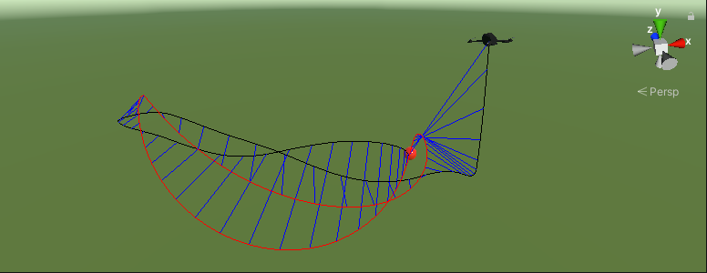

# Quadcopter Control with Deep Reinforcement Learning and PID Controllers in Simulated Environments

## About

This repository contains the code for my master's degree thesis project, and a copy of the dissertation for the degree of Master of Science in Intelligent Systems and Robotics at the University of Essex.

This project was elaborated in Unity over the course of several months, and is comprised of the following:

- A simulated quadcopter coded from scratch based on realistic motor and aerodynamic models.
- A custom PID controller class with additions such as anti-windup.
- Code which uses multiple PID controllers to pilot a quadcopter.
- An implementation of a genetic algorithm which finds optimal gains for the PID controllers.
- Code based on ML-Agents which allows a neural network to pilot the quadcopter.
- Code which can train deep reinforcement learning agents to learn to fly the quadcopter with the help of ML-Agents.
- Several training and testing environments for the quadcopter:
    - A hovering environment.
    - A path following environment.
    - A landing environment.
- A semi-realistic 3D model of a quadcopter.

## Dissertation

A copy of the dissertation for this project has been included as the file Dissertation.pdf

### Abstract

Quadcopters are interesting autonomous vehicles which are highly unstable systems. A common method of controlling quadcopters is with PID controllers, however researchers are actively investigating the feasibility of using deep reinforcement learning as an alternative method. This dissertation seeks to compare the differences between using the state-of-the-art deep reinforcement learning algorithm Proximal Policy Optimization to control a quadcopter against using PID controllers with an anti-windup mechanism. A virtual environment which was created from scratch by the author in Unity is used to simulate quadcopters while also serving as a framework to facilitate future work related to quadcopters, PID controllers and deep reinforcement learning.

This dissertation additionally presents and implements a novel method of tuning PID controllers through a genetic algorithm that finds the optimal gains for the controllers based on a reward function. This method allows the gains of the PID controllers to be learnt while optimising the same reward functions as deep reinforcement learning algorithms, minimising the possibility of discrepancies that can invalidate comparisons between PID controllers and deep reinforcement learning algorithms.

Three tasks are used to compare different behaviours for the quadcopters: one for hovering, one for following a path and one for landing on a target.

## File Structure

The Quadcopter directory contains the Unity project (open the project from this directory) and the main source code. You can find the bulk of the code under the Assets directory. As for how the code works, the following diagram gives a brief overview of how everything is structured. This is explained more in detail in Section 3.1.1 - Code Overview of my dissertation.

The Tests directory contains several tests done in Simulink, Matlab and Excel to verify that the models work correctly.

The Tools directory contains some scripts which were used to facilitate several actions that had to be done while working on the project, such as plotting graphs and generating yaml files for training.

The Training directory is divided into the three simulation environments and a folder called Hyperparameters. The Hyperparameters folder contains yaml files used to test the different hyperparameters for the deep reinforcement learning algorithms, while the simulation environment folders contain the results of training, such as the PID gains and the deep reinforcement learning parameters viewable in Tensorboard.
